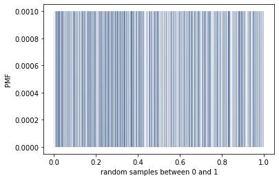
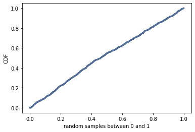

[Think Stats Chapter 4 Exercise 2](http://greenteapress.com/thinkstats2/html/thinkstats2005.html#toc41) (a random distribution)

**Exercise 2**   The numbers generated by random.random are supposed to be uniform between 0 and 1; that is, every value in the range should have the same probability.
Generate 1000 numbers from random.random and plot their PMF and CDF. Is the distribution uniform?

```python
ch4_df = np.random.random(1000)
ex2_pmf = thinkstats2.Pmf(ch4_df)
thinkplot.Pmf(ex2_pmf, linewidth = 0.1)
thinkplot.Show(xlabel = "random samples between 0 and 1", ylabel = "PMF")

ex2_cdf = thinkstats2.Cdf(ch4_df)
thinkplot.Cdf(ex2_cdf)
thinkplot.Show(xlabel = "random samples between 0 and 1", ylabel = "CDF")
```
PMF of random samples generated from a uniform distribution:



CDF of random samples generated from a uniform distribution:



The distribution is uniform as shown in both graphs.
