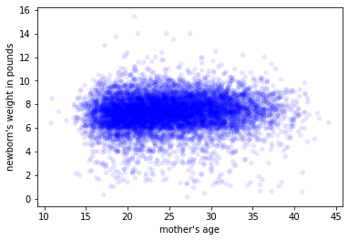
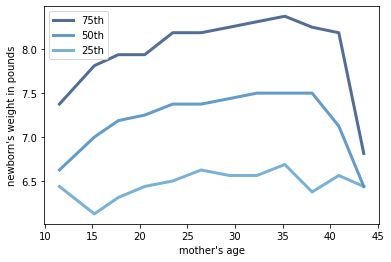

[Think Stats Chapter 7 Exercise 1](http://greenteapress.com/thinkstats2/html/thinkstats2008.html#toc70) (weight vs. age)

**Exercise 1**   Using data from the NSFG, make a scatter plot of birth weight versus mother’s age. Plot percentiles of birth weight versus mother’s age. Compute Pearson’s and Spearman’s correlations. How would you characterize the relationship between these variables?

```python
import first
df_ch7, firsts, others = first.MakeFrames()
thinkplot.Scatter(df_ch7.agepreg, df_ch7.totalwgt_lb, alpha = 0.1)
thinkplot.Show(xlabel = "mother's age", ylabel = "newborn's weight in pounds")

dfsub_ch7 = df_ch7.dropna(subset = ["agepreg", "totalwgt_lb"])
bins = np.arange(10, 50, 5)
indices = np.digitize(dfsub_ch7.agepreg, bins)
groups = dfsub_ch7.groupby(indices)
age = [group.agepreg.mean() for i, group in groups]
cdfs = [thinkstats2.Cdf(group.totalwgt_lb) for i, group in groups]
for percent in [75, 50, 25]:
    weights = [cdf.Percentile(percent) for cdf in cdfs]
    label = "%dth" % percent
    thinkplot.Plot(age, weights, label = label)   
thinkplot.Config(xlabel = "mother's age", ylabel = "newborn's weight in pounds",legend = True)

Pearson_cor = Corr(dfsub_ch7.totalwgt_lb, dfsub_ch7.agepreg)
print("Pearson's correlation between newborn's weight and mother's age is {0:0.3f}".format(Pearson_cor))
Spearman_cor = SpearmanCorr(dfsub_ch7.totalwgt_lb, dfsub_ch7.agepreg)
print("Spearman's correlation between newborn's weight and mother's age is {0:0.3f}".format(Spearman_cor))
```
Scatter plot of birth weight vs. mother's age:



Percentiles of birth weight vs. mother's age:



Pearson's correlation between birth weight and mother's age is 0.069.
Spearman's correlation between birth weight and mother's age is 0.095.

From the percentiles of birth weight vs. mother's age plot, there seems to be a positive correlation between the two variables when the mother's age is between 15 to 35 years old. However when we consider the full range of mother's age, the correlation is not linear. Both Pearson's and Spearman's correlations are <0.1, indicating the relationship between the two variables is weak.  
