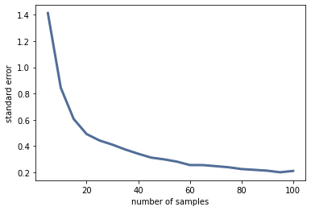

[Think Stats Chapter 8 Exercise 2](http://greenteapress.com/thinkstats2/html/thinkstats2009.html#toc77) (scoring)

**Exercise 2**  Suppose you draw a sample with size n=10 from an exponential distribution with λ=2. Simulate this experiment 1000 times and plot the sampling distribution of the estimate L. Compute the standard error of the estimate and the 90% confidence interval. Repeat the experiment with a few different values of n and make a plot of standard error versus n.

```python
import cumulative
import estimation
import thinkstats2
import thinkplot
import numpy as np

def Estimate(n = 10, m = 1000):
    lam = 2
    lam_ests = []
    for i in range(m):
        samples = np.random.exponential(1.0/lam, n)
        L = 1 / np.mean(samples)
        lam_ests.append(L)
    cdf = thinkstats2.Cdf(lam_ests)
    thinkplot.Cdf(cdf)
    thinkplot.Show(xlabel = "1/sample mean (lambda estimates)", ylabel = "CDF", title = "Sampling distribution")
    ci = cdf.Percentile(5), cdf.Percentile(95)
    stderr = estimation.RMSE(lam_ests, lam)
    return ci, stderr
Estimate()

def Estimate2(n = 10, m = 1000):
    lam = 2
    lam_ests = []
    for i in range(m):
        samples = np.random.exponential(1.0/lam, n)
        L = 1 / np.mean(samples)
        lam_ests.append(L)
    stderr = estimation.RMSE(lam_ests, lam)
    return stderr

n = np.arange(5, 105, 5)
def stderrs(n):
    stderrs = []
    for i in n:
        stderrs.append(Estimate2(i))
    return stderrs
thinkplot.Plot(n, stderrs(n))
thinkplot.Show(xlabel = "number of samples", ylabel = "standard error")
```
**Sampling distribution of the estimate L:**


Standard error of the estimate is 0.864.
The 90% confidence interval is (1.250, 3.783).

**Standard error vs. sample sizes:**



Standard error (SE) decreases as sample size increases. The drop in SE is the most significant in sample size range 5 to 20. SE is 1.558 when sample size is 5, but drops to 0.496 at sample size 20. 


