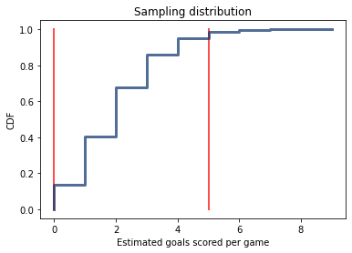

[Think Stats Chapter 8 Exercise 3](http://greenteapress.com/thinkstats2/html/thinkstats2009.html#toc77)

**Exercise 3**  In games like hockey and soccer, the time between goals is roughly exponential. So you could estimate a team’s goal-scoring rate by observing the number of goals they score in a game. This estimation process is a little different from sampling the time between goals, so let’s see how it works.

Write a function that takes a goal-scoring rate, lam, in goals per game, and simulates a game by generating the time between goals until the total time exceeds 1 game, then returns the number of goals scored.

Write another function that simulates many games, stores the estimates of lam, then computes their mean error and RMSE.

Is this way of making an estimate biased? Plot the sampling distribution of the estimates and the 90% confidence interval. What is the standard error? What happens to sampling error for increasing values of lam?

```python
def goals_scored(lam):
    total_time = 0
    goals = 0
    while total_time <= 1:
        time = np.random.exponential(1.0/lam, 1)
        total_time += time
        goals += 1
    goals_scored = goals - 1
    return goals_scored
    
def estimates_exp(lam = 2, m = 10000):
    goals = []
    for i in range(m):
        goals.append(goals_scored(lam))
    mean_error = estimation.MeanError(goals, lam)
    RMSE = estimation.RMSE(goals, lam)
    pmf = thinkstats2.Pmf(goals)
    thinkplot.Hist(pmf)
    thinkplot.Show(xlabel = "estimated goals scored per game", ylabel = "PMF", title = "Sampling distribution")
    print("Mean error is {:0.4F}".format(mean_error))
    print("RMSE is is {:0.4F}".format(RMSE))

estimates_exp()

def estimates_CI(lam = 2, m = 10000):
    goals = []
    for i in range(m):
        goals.append(goals_scored(lam))
    cdf = thinkstats2.Cdf(goals)
    ci = cdf.Percentile(5), cdf.Percentile(95)
    thinkplot.Plot([ci[0], ci[0]], [0, 1], color = "red", linewidth = 2)
    thinkplot.Plot([ci[1], ci[1]], [0, 1], color = "red", linewidth = 2)
    thinkplot.Cdf(cdf)
    thinkplot.Show(xlabel = "Estimated goals scored per game", ylabel = "CDF", title = "Sampling distribution")
    
estimates_CI()

def estimates_error(lam = 2, m = 10000):
    goals = []
    for i in range(m):
        goals.append(goals_scored(lam))
    stderr = estimation.RMSE(goals, lam)
    return stderr
for lam in range(2, 11, 1):
    stderr = estimates_error(lam, m = 10000)
    print("Standard Error for lambda equals to {} is {:0.4F}".format(lam, stderr))
```

Sampling distribution of the estimates and 90% confidence interval:



The mean error for the estimates is 0.0147 and it converges to 0 as the number of estimates increases, indicating the estimator is unbiased. 
The standard error for the estimates is 1.4180 with lambda equals to 2. It increases as the value of lambda increases. 
* Standard Error for lambda equals to 3 is 1.7519
* Standard Error for lambda equals to 6 is 2.4221
* Standard Error for lambda equals to 9 is 3.0018
